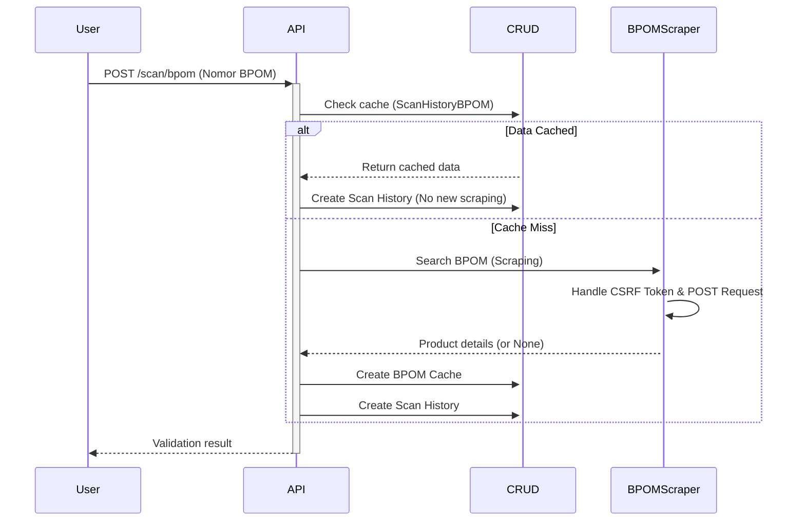

<div align="center">

```
              ██╗      █████╗  ██████╗ █████╗ ██╗  ██╗    ███╗   ██╗██╗   ██╗████████╗██████╗ ██╗
              ██║     ██╔══██╗██╔════╝██╔══██╗██║ ██╔╝    ████╗  ██║██║   ██║╚══██╔══╝██╔══██╗██║
              ██║     ███████║██║     ███████║█████╔╝     ██╔██╗ ██║██║   ██║   ██║   ██████╔╝██║
              ██║     ██╔══██║██║     ██╔══██║██╔═██╗     ██║╚██╗██║██║   ██║   ██║   ██╔══██╗██║
              ███████╗██║  ██║╚██████╗██║  ██║██║  ██╗    ██║ ╚████║╚██████╔╝   ██║   ██║  ██║██║
              ╚══════╝╚═╝  ╚═╝ ╚═════╝╚═╝  ╚═╝╚═╝  ╚═╝    ╚═╝  ╚═══╝ ╚═════╝    ╚═╝   ╚═╝  ╚═╝╚═╝
```

### Smart Nutrition Tracking & BPOM Validation Platform

**Transparansi Instan, Keputusan Terinformasi**

[](https://lacaknutri.rbwtech.io)
[](https://github.com/rbwtech/lacak-nutri)
[](LICENSE)

## NAVIGATION / TABLE OF CONTENTS
- [Overview](#overview)
- [Demo Access](#demo-access)
- [Core Features](#core-features)
- [Technology Stack](#technology-stack)
- [Quick Start (Installation)](#quick-start-installation)
- [Design System](#design-system)
- [API Docs](API_DOCUMENTATION.MD)
- [License](#license)
- [Team](#team)
- [Acknowledgement](#acknowledgement)
- [Support](#support)

[API Docs](https://github.com/rbwtech/lacak-nutri/blob/main/API_DOCUMENTATION.MD)

</div>

---

## Overview

LacakNutri adalah aplikasi web berbasis Full Stack dan AI yang dirancang untuk memberikan analisis nutrisi instan dan validasi keamanan pangan untuk produk makanan/minuman kemasan. Aplikasi ini menggunakan Vision Language Model (VLM) dari Google Gemini untuk memproses label nutrisi dan komposisi dari gambar, serta mekanisme web scraping untuk memverifikasi status registrasi produk ke database resmi BPOM.

**Problem Statement:** Minimnya transparansi informasi nilai gizi dan kesulitan memverifikasi keamanan produk BPOM.

**Solution:** Platform end-to-end yang mengubah label fisik menjadi data terstruktur dengan insight kesehatan personal dalam hitungan detik.

### Core Value

```
Capture Image → AI Analysis (VLM) → Personalized Health Insights
QR Code → BPOM Validation (Scraping) → BPOM Result
```

**Target Users:**

- Konsumen sadar kesehatan
- Keluarga dengan kondisi alergi/diet khusus
- Individu dengan penyakit metabolik (diabetes, hipertensi)
- Masyarakat umum yang peduli keamanan pangan

---

## DEMO ACCESS

### Live Instance

**URL:** https://lacaknutri.rbwtech.io

### Admin Dashboard (Demo)

```
Email: lacaknutri@rbwtech.io
Password: UINIC7.0
```

**Capabilities:**

- Full CRUD operations
- Real-time analytics dashboard
- User management
- Content moderation (GiziPedia)
- Scan history monitoring

### Test Credentials (Regular User)

```
Email: demo@lacaknutri.com
Password: demo123
```

---

## CORE FEATURES

```
Disclaimer:
Fungsi utama /api/scan/analyze menggunakan Gemini AI (VLM) untuk membaca dan menganalisis label dari gambar secara langsung. Ini lebih dari sekadar OCR; ini adalah analisis gambar terstruktur. Tesseract hanya digunakan untuk raw text extraction di endpoint terpisah (/api/scan/ocr-text).
```

### 1\. Vision-Powered Nutrition Analysis (VLM & AI)

**Engine:** Google Gemini 2.5 Flash

**AI Analysis Pipeline (`/api/scan/analyze`)**:

```mermaid
graph TD
A[User Uploads Image] --> B["GeminiService analyze_nutrition_image"]
B -- Prompt + Image --> C(Gemini VLM Analysis)
C -- Structured JSON --> D[Backend Service]
D -- Extract Ingredients --> E{Check User Allergies}
E -- Detected Allergens --> F(Create ScanHistoryOCR)
F --> G[Display Scan Result]

%% Style blocks
style C fill:#222d3d,stroke:#333,stroke-width:2px
style B fill:#222d3d,stroke:#333,stroke-width:1px
```



**Hasil Structured JSON yang Dikelola oleh AI Service:**

| Field | Tipe Data | Deskripsi |
| :--- | :--- | :--- |
| **`nutrition`** | JSON Object | Data nutrisi terstruktur (kalori, protein, lemak, gula, sodium, dll.). |
| **`health_score`** | Integer (0-100) | Penilaian kesehatan objektif oleh AI. |
| **`grade`** | String (A-E) | Kategori nilai kesehatan berdasarkan `health_score`. |
| **`summary`** | String | Ringkasan analisis nutrisi (2-3 kalimat). |
| **`pros`, `cons`** | List of Strings | Keunggulan dan kelemahan nutrisi yang terdeteksi. |
| **`ingredients`** | String | Daftar bahan yang diekstraksi. |
| **`warnings`** | List of Strings | Daftar potensi peringatan (misalnya, Tinggi Gula, Aditif) **ditambah alergen yang terdeteksi dari profil pengguna**. |

#### Rate Limiting (Keterbatasan Penggunaan)

Untuk menjaga *resource* AI, *endpoint* `/api/scan/analyze` memiliki batasan penggunaan harian:

  - **Pengguna Tamu (Guest)** atau **Pengguna Terdaftar Biasa**: Maksimal **10x Analisis AI per hari**.
  - **Administrator**: Tidak memiliki batasan.

### 2\. BPOM Validation

Fitur ini memvalidasi produk menggunakan nomor registrasi BPOM yang diinput (MD/ML/SI/DBL) atau dipindai QR-nya.

**Mekanisme:** **Web Scraping** (menggunakan `httpx` dan `BeautifulSoup4`) dari situs resmi BPOM (`https://cekbpom.pom.go.id`).

**Alur Validasi BPOM (`/api/scan/bpom`)**:



**Benefit Caching:** Hasil *scraping* disimpan dalam *database* (`bpom_cache`) untuk menghemat *resource* dan memberikan respons cepat.

**Sample Response:**

```json
{
  "success": true,
  "data": {
    "registration_number": "MD 272831023097",
    "product_name": "Indomie Goreng",
    "brand": "PT Indofood CBP Sukses Makmur Tbk",
    "status": "TERDAFTAR",
    "expiry_date": "2028-12-31",
    "cached": false
  }
}
```

### 3\. Allergen Cross-Reference (Personalisasi)

*Endpoint* `/api/scan/analyze` secara otomatis memeriksa bahan-bahan yang diidentifikasi oleh AI terhadap daftar alergi yang tersimpan di profil pengguna.

  * Daftar alergi pengguna diambil dari *database* (`current_user.allergies`).
  * Daftar bahan (`ingredients`) dari hasil AI diubah menjadi huruf kecil dan diperiksa keberadaan alergen yang telah diatur oleh pengguna.
  * Alergen yang terdeteksi ditambahkan ke dalam *field* `warnings` sebelum disimpan ke `ScanHistoryOCR` dan ditampilkan kepada pengguna.

### 4\. Food Catalog (Database Makanan)

Akses cepat ke database internal yang berisi **4.122 data produk** makanan dan minuman yang telah terkurasi.

**Fitur Utama:**

  * **Pencarian Cepat (`/api/food/search`):** Mencari produk berdasarkan nama atau merek.
  * **Detail Nutrisi:** Menampilkan informasi nilai gizi (AKG), komposisi, dan takaran saji tanpa perlu melakukan scan ulang.
  * **Pagination:** Mendukung *infinite scroll* atau *pagination* untuk menjelajahi katalog.

**Data Point:**

  * 4.122 entri produk unik.
  * Mencakup kategori: Makanan Ringan, Minuman, Produk Susu, Makanan Instan, dll.

### 5\. Favorites Management

Pengguna dapat menyimpan produk hasil scan atau pencarian ke dalam daftar favorit untuk akses cepat di kemudian hari.

  * **Endpoint:** `/api/favorites`
  * **Fungsi:** Simpan (`POST`), Hapus (`DELETE`), dan Lihat Daftar (`GET`) produk favorit.
  * **Integrasi:** Terhubung langsung dengan *Food Catalog* dan *Scan History*.

### 6\. GiziPedia (Education Hub)

**Content Structure:**

  - **Categories:** Zat Gizi Makro, Zat Gizi Mikro, Aditif Makanan, Label & Istilah
  - **Articles:** 100 artikel edukasi
  - **Format:** Markdown-based dengan images
  - **Search:** Full-text search dengan relevance ranking

**Features:**

  - Rich text editor (admin)
  - Category filtering
  - Bookmark system
  - Reading time estimate
  - Related articles

### 7\. Allergen Management System

Manajemen data alergen yang dinamis.

**Allergen Database:**
Admin dapat mengelola master data alergen (cth: Kacang, Susu, Gluten, Seafood) yang nantinya dipilih oleh user di profil mereka.

**Detection Logic (Actual Implementation):**

```python
# app/routers/scan.py
user_allergies = [allergy.name.lower() for allergy in current_user.allergies]
ingredients_text = result.get('ingredients', '').lower()

detected_allergens = [
    allergy.capitalize() 
    for allergy in user_allergies 
    if allergy in ingredients_text
]
# Result: ["Kacang Tanah", "Gluten"]
```

### 8\. Scan History & Analytics

Setiap aktivitas scan (OCR maupun BPOM) disimpan untuk referensi pengguna.

  - **Riwayat Terpisah:** Tab khusus untuk Riwayat OCR dan Riwayat BPOM.
  - **Detail View:** Pengguna dapat melihat kembali detail nutrisi dan hasil analisis AI dari produk yang pernah discan sebelumnya.
  - **Admin Analytics:** Admin dapat memantau jumlah scan harian untuk mengevaluasi penggunaan sistem.

-----

## TECHNOLOGY STACK

### Frontend Architecture

```
React 18 (Vite 6)
├── Routing: React Router v7
├── State: TanStack Query v5 + Context API
├── UI: Tailwind CSS 3 + Framer Motion (Animation) + Lucide React (Icons)
├── Forms: React Hook Form + Zod validation
├── HTTP: Axios
├── Scanner: html5-qrcode
├── Charts: Chart.js + react-chartjs-2
└── Build: Vite 6 (ES modules)
```

**Key Dependencies (`package.json`):**

```json
{
  "react": "^18.3.1",
  "vite": "^6.0.5",
  "react-router-dom": "^7.1.1",
  "@tanstack/react-query": "^5.64.1",
  "tailwindcss": "^3.4.17",
  "axios": "^1.7.9",
  "html5-qrcode": "^2.3.8",
  "chart.js": "^4.4.7",
  "react-chartjs-2": "^5.3.0",
  "react-hook-form": "^7.54.2",
  "zod": "^3.24.1",
  "framer-motion": "^11.16.0",
  "lucide-react": "^0.471.0"
}
```

**Folder Structure:**

```
frontend/
├── src/
│   ├── components/        # UI Components
│   │   ├── layout/        # Header, Footer, MainLayout
│   │   ├── ui/            # Reusable (Button, Card, Modal, Input, Toast)
│   │   └── features/      # NutritionLabel
│   ├── pages/             # Page Components (Home, Scanner, History, Admin...)
│   │   └── admin/         # Admin Specific Pages (Dashboard, Products, Users)
│   ├── hooks/             # Custom hooks (useAuth, useCommon, useOwnerAuth)
│   ├── context/           # Global State (AuthContext)
│   ├── config/            # API Configuration (api.js)
│   ├── routes/            # Route Definitions (AdminRoute, ProtectedRoute)
│   ├── i18n/              # Localization (id/en)
│   ├── utils/             # Helper functions (helpers.js)
│   └── assets/            # Static Assets
├── public/
└── vite.config.js
```

### Backend Architecture

```
FastAPI + Python 3.11
├── ORM: SQLAlchemy 2.0
├── Database: PyMySQL (MariaDB connector)
├── Validation: Pydantic v2
├── Auth: JWT (python-jose) + Passlib (bcrypt)
├── AI: google-genai (Google DeepMind SDK terbaru)
├── OCR: Pytesseract (Tesseract OCR Wrapper)
├── Scraping: HTTPX + BeautifulSoup4
├── Image Processing: Pillow
└── Server: Uvicorn (ASGI)
```

**Key Dependencies (`requirements.txt`):**

```python
fastapi>=0.100.0
uvicorn>=0.20.0
sqlalchemy>=2.0.0
pymysql>=1.0.0
pydantic>=2.0.0
python-jose[cryptography]>=3.3.0
passlib>=1.7.4
python-multipart>=0.0.6
google-genai>=0.1.0       
beautifulsoup4>=4.12.0
httpx>=0.24.0
pillow>=10.0.0
pytesseract
```

**Project Structure:**

```
backend/
├── app/
│   ├── routers/           # API Endpoints (Routes)
│   │   ├── auth.py        # Authentication
│   │   ├── admin.py       # Admin Operations
│   │   ├── scan.py        # OCR & AI Analysis
│   │   ├── food.py        # Food Catalog Operations
│   │   ├── favorites.py   # User Favorites
│   │   ├── education.py   # Articles & GiziPedia
│   │   └── users.py       # User Profile Management
│   ├── crud/              # Database Operations (Create, Read, Update, Delete)
│   ├── models/            # SQLAlchemy Database Models
│   ├── schemas/           # Pydantic Response/Request Models
│   ├── services/          # External Logics
│   │   ├── ai_service.py     # Gemini AI Integration
│   │   └── bpom_endpoint.py  # BPOM Scraping Logic
│   ├── core/              # Config, Database, Security
│   └── main.py            # FastAPI Entry Point
├── uploads/               # Local Storage for Images
└── requirements.txt
```

### Database Schema

**Technology:** MariaDB 11.4.4 (via PyMySQL)

**Schema Design:**

```sql
-- Users & Authentication
users (14 columns)
├── id (PK)
├── email (UNIQUE), password_hash, full_name
├── role (enum: user, admin, owner)
├── gender, age, height, weight
├── activity_level (enum: sedentary, light, moderate, active, very_active)
├── reset_token, reset_token_expires
└── created_at, updated_at

-- Reference Data
allergens (
  id, name, code, category, description, 
  severity_level, created_by, timestamps
)
additives (
  id, name, code, category, safety_level, 
  description, health_risks, timestamps
)

-- User Relations
user_allergies (id, user_id, allergen_id, notes)
favorites (
  id, user_id, 
  food_id (FK -> foods), 
  scan_ocr_id (FK -> scan_history_ocr), 
  scan_bpom_id (FK -> scan_history_bpom), 
  created_at
)

-- Core Data: Scan History
scan_history_ocr (14 columns)
├── id (PK), user_id (FK)
├── image_data (LONGTEXT/Base64)
├── product_name
├── ocr_raw_data (JSON)      -- Stores calories, protein, etc.
├── ai_analysis (TEXT)       -- AI Summary
├── pros (JSON), cons (JSON)
├── ingredients (TEXT)
├── warnings (JSON)          -- Includes allergen warnings
├── health_score (INT), grade (VARCHAR)
└── is_favorited (BOOL), created_at

scan_history_bpom (10 columns)
├── id (PK), user_id (FK)
├── bpom_number, product_name, brand, manufacturer
├── status (TERDAFTAR, dll)
├── raw_response (JSON)      -- Full scraped data
└── is_favorited (BOOL), created_at

-- Core Data: Food Catalog
foods (18 columns)
├── id (PK)
├── name, brand, barcode
├── serving_size, calories, proteins, fats, carbs
├── fiber, sugar, sodium
├── ingredients, image_url
├── external_id, data_source
└── timestamps

-- Caching & Content
bpom_cache (id, bpom_number, data (JSON), timestamps)
articles (id, title, slug, content, category_id, status, views, timestamps)
article_categories (id, name, slug, description)
```

**ERD Logic (Simplified):**

```
      [foods] <───────┐
                      │
  [scan_history_ocr] ─┼──► [favorites] ◄── [users] ──► [user_allergies] ──► [allergens]
                      │
 [scan_history_bpom] ─┘
```

### Infrastructure & Deployment

**Frontend Hosting:**

```yaml
Platform: VPS (Dedicated Server)
Web Server: Nginx 1.24
SSL: Let's Encrypt
Deployment: Manual Build (dist/) -> Nginx Serve
```

**Backend Hosting:**

```yaml
Platform: Railway / Render (Containerized)
Runtime: Python 3.11
Server: Uvicorn
Environment: Production
Base URL: https://backend-url.railway.app
```

**Database:**

```yaml
Server: VPS (aaPanel Managed)
DBMS: MariaDB 11.4.4
Connection: Remote (PyMySQL) via Host IP
```

-----

## QUICK START (INSTALLATION)

### Prerequisites

```bash
Node.js 18+
Python 3.11+
MariaDB 11.4.4
Git
```

### 1\. Clone Repository

```bash
git clone https://github.com/rbwtech/lacak-nutri.git
cd lacak-nutri
```

### 2\. Database Setup

**Create Database:**

```sql
CREATE DATABASE lacak_nutri CHARACTER SET utf8mb4 COLLATE utf8mb4_unicode_ci;
```

**Import Schema:**

Pastikan Anda berada di *root directory* project (`lacak-nutri/`).

```bash
mysql -u root -p lacak_nutri < database/schema.sql
mysql -u root -p lacak_nutri < database/seed.sql
```

### 3\. Backend Configuration

**Install Dependencies:**

```bash
cd backend
python -m venv venv
source venv/bin/activate  # Windows: venv\Scripts\activate
pip install -r requirements.txt
```

**Environment Variables (.env):**

Buat file `.env` di dalam folder `backend/` dan isi sesuai konfigurasi berikut:

```env
DB_HOST=localhost
DB_PORT=3306
DB_NAME=lacak_nutri
DB_USER=root
DB_PASSWORD=your_password

SECRET_KEY=generate_your_secure_secret_key_here
ALGORITHM=HS256
ACCESS_TOKEN_EXPIRE_MINUTES=43200

GEMINI_API_KEY=your_google_gemini_api_key

UPLOAD_DIR=./uploads
MAX_UPLOAD_SIZE=10485760

CORS_ORIGINS=http://localhost:5173

DEBUG=True
HOST=0.0.0.0
PORT=8000

RECAPTCHA_SECRET_KEY=your_recaptcha_server_secret
EMAIL_SENDER_NAME="Lacak Nutri Admin"
EMAIL_SENDER_ADDRESS=admin@lacaknutri.com

SMTP_SERVER=smtp.gmail.com
SMTP_PORT=587
SMTP_USERNAME=your_email@gmail.com
SMTP_PASSWORD=your_app_password
```

**Run Server:**

Pastikan *virtual environment* aktif dan Anda berada di folder `backend/`.

```bash
uvicorn main:app --reload --host 0.0.0.0 --port 8000
```

Server: `http://localhost:8000`
API Docs: `http://localhost:8000/docs`

### 4\. Frontend Configuration

**Install Dependencies:**

Buka terminal baru dan masuk ke folder frontend.

```bash
cd frontend
npm install
```

**Environment Variables (.env):**

Buat file `.env` di dalam folder `frontend/`.

```env
VITE_API_URL=http://localhost:8000/api
VITE_RECAPTCHA_SITE_KEY=your_recaptcha_client_site_key
```

**Run Development Server:**

```bash
npm run dev
```

Frontend: `http://localhost:5173`

### 5\. Production Build

**Frontend:**

```bash
npm run build
# Output akan berada di folder: dist/
```

**Backend:**

```bash
# Menggunakan Gunicorn (Linux/Mac)
gunicorn main:app -w 4 -k uvicorn.workers.UvicornWorker --bind 0.0.0.0:8000

# Atau Uvicorn langsung (Windows/Simple Deploy)
uvicorn main:app --host 0.0.0.0 --port 8000 --workers 4
```

-----

## DESIGN SYSTEM

Sistem desain LacakNutri menggunakan tema kustom Tailwind CSS dengan dukungan penuh untuk **Light Mode** dan **Dark Mode**.

### Color Palette

Warna dikelola menggunakan CSS Variables untuk mendukung pergantian tema yang mulus.

| Color Token | Light Mode (Hex) | Dark Mode (Hex) | Penggunaan Utama |
| :--- | :--- | :--- | :--- |
| **Primary** | `#FF9966` | `#FF9966` | Brand identity, CTA buttons, links |
| **Primary Hover** | `#FF7A4D` | `#FF7A4D` | Hover states |
| **Secondary** | `#6B8E23` | `#8ABE53` | Status sehat, verifikasi (adjusted for contrast) |
| **Accent** | `#A1D2D5` | `#5D8A8D` | Dekorasi, info cards, highlights |
| **Background Base** | `#FDFDF5` | `#121212` | Latar belakang utama aplikasi |
| **Background Surface** | `#FFFFF7` | `#1E1E1E` | Kartu (Cards), Modal, Sidebar |
| **Text Primary** | `#333333` | `#E0E0E0` | Judul, konten utama |
| **Text Secondary** | `#8C8C8C` | `#A0A0A0` | Label, metadata, deskripsi singkat |
| **Border** | `#EBE3D5` | `#333333` | Garis pemisah, border input |

**Status Colors (Hardcoded):**

  - Success: `#4CAF50`
  - Warning: `#FFC107`
  - Error: `#EF5350`

### Typography

**Font Family:**
Menggunakan **Manrope** dari Google Fonts sebagai font utama, dengan fallback ke Inter dan sans-serif.

```css
font-family: "Manrope", "Inter", "sans-serif";
```

**Weights:** 400 (Regular), 500 (Medium), 600 (SemiBold), 700 (Bold), 800 (ExtraBold).

### UI Components Styling

Konfigurasi Tailwind (`tailwind.config.js`) mencakup kustomisasi berikut:

**Border Radius:**

  - `rounded-xl`: 12px
  - `rounded-2xl`: 16px
  - `rounded-3xl`: 24px

**Box Shadow:**

  - `shadow-soft`: `0 8px 24px rgba(0, 0, 0, 0.05)`

**Animations:**

  - **Blob:** Animasi background fluid (`blob 7s infinite`).
  - **Fade In:** Transisi masuk elemen (`fadeIn 0.5s ease-out`).

-----

## LICENSE

This project is licensed under the **MIT License**.

```
MIT License

Copyright (c) 2025 Trio WakwaW Team

Permission is hereby granted, free of charge, to any person obtaining a copy
of this software and associated documentation files (the "Software"), to deal
in the Software without restriction, including without limitation the rights
to use, copy, modify, merge, publish, distribute, sublicense, and/or sell
copies of the Software, and to permit persons to whom the Software is
furnished to do so, subject to the following conditions:

The above copyright notice and this permission notice shall be included in all
copies or substantial portions of the Software.

THE SOFTWARE IS PROVIDED "AS IS", WITHOUT WARRANTY OF ANY KIND, EXPRESS OR
IMPLIED, INCLUDING BUT NOT LIMITED TO THE WARRANTIES OF MERCHANTABILITY,
FITNESS FOR A PARTICULAR PURPOSE AND NONINFRINGEMENT.
```

---

## TEAM

**Trio WakwaW Team** - UINIC 7.0 Web Development Competition

```
┌─────────────────────────────────────────────────────┐
│  Made with ❤️ by Trio WakwaW Team
│
│  • Radipta Basri Wijaya
│  • Agung Nugraha
│  • Bayu Wicaksono
│
└─────────────────────────────────────────────────────┘
```

---

## ACKNOWLEDGEMENT

**Technologies:**

- [FastAPI](https://fastapi.tiangolo.com/) - Modern Python web framework
- [React](https://react.dev/) - UI library
- [Gemini AI](https://ai.google.dev/) - Generative AI analysis
- [BPOM](https://cekbpom.pom.go.id/) - Public product registration database

**Inspiration:**

- MyFitnessPal - Nutrition tracking
- Open Food Facts - Open food database
- BPOM Mobile - Product verification

**Competition:**

- UINIC 7.0 Web Development - Universitas Islam Negeri Sunan Kalijaga Yogyakarta

---

## SUPPORT

**Issues & Bugs:**  
Report via [GitHub Issues](https://github.com/rbwtech/lacak-nutri/issues)

**Feature Requests:**  
Submit via [GitHub Discussions](https://github.com/rbwtech/lacak-nutri/discussions)

**General Inquiries:**  
WhatsApp: wa.me/6285182381003

---

<div align="center">

**⭐ Star us on GitHub if you find this project useful!**

**LacakNutri** © 2025 Trio WakwaW Team

</div>
