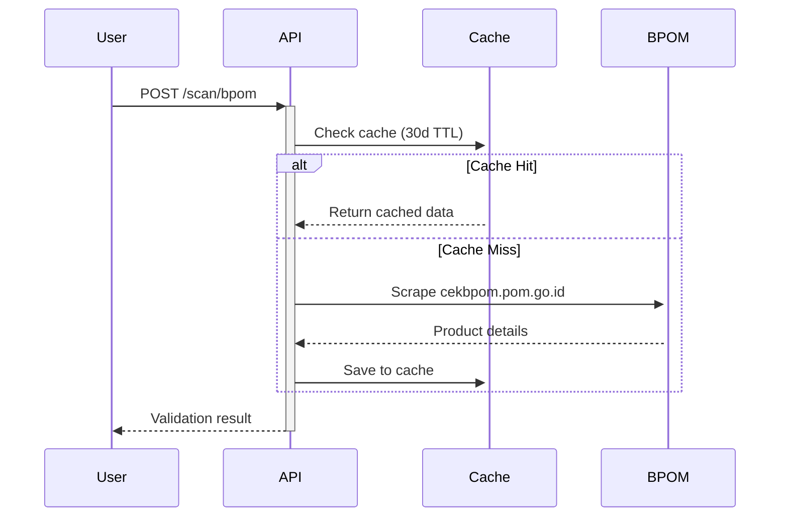

<div align="center">

```
██╗      █████╗  ██████╗ █████╗ ██╗  ██╗    ███╗   ██╗██╗   ██╗████████╗██████╗ ██╗
██║     ██╔══██╗██╔════╝██╔══██╗██║ ██╔╝    ████╗  ██║██║   ██║╚══██╔══╝██╔══██╗██║
██║     ███████║██║     ███████║█████╔╝     ██╔██╗ ██║██║   ██║   ██║   ██████╔╝██║
██║     ██╔══██║██║     ██╔══██║██╔═██╗     ██║╚██╗██║██║   ██║   ██║   ██╔══██╗██║
███████╗██║  ██║╚██████╗██║  ██║██║  ██╗    ██║ ╚████║╚██████╔╝   ██║   ██║  ██║██║
╚══════╝╚═╝  ╚═╝ ╚═════╝╚═╝  ╚═╝╚═╝  ╚═╝    ╚═╝  ╚═══╝ ╚═════╝    ╚═╝   ╚═╝  ╚═╝╚═╝
```

### Smart Nutrition Tracking & BPOM Validation Platform

**Transparansi Instan, Keputusan Terinformasi**

[](https://lacaknutri.rbwtech.io)
[](https://github.com/rbwtech/lacak-nutri)
[](LICENSE)

[Demo](#-demo-access) • [Features](#-core-features) • [Tech Stack](#-technology-stack) • [Installation](#-quick-start) • [API Docs](#-api-documentation) • [Team](#-team)

</div>

---

## Overview

LacakNutri adalah aplikasi web berbasis Full Stack dan AI yang dirancang untuk memberikan analisis nutrisi instan dan validasi keamanan pangan untuk produk makanan/minuman kemasan. Aplikasi ini menggunakan Vision Language Model (VLM) dari Google Gemini untuk memproses label nutrisi dan komposisi dari gambar, serta mekanisme web scraping untuk memverifikasi status registrasi produk ke database resmi BPOM.

**Problem Statement:** Minimnya transparansi informasi nilai gizi dan kesulitan memverifikasi keamanan produk BPOM.

**Solution:** Platform end-to-end yang mengubah label fisik menjadi data terstruktur dengan insight kesehatan personal dalam hitungan detik.

### Core Value

```
Capture Image → AI Analysis (VLM) → Personalized Health Insights
QR Code → BPOM Validation (Scraping) → BPOM Result
```

**Target Users:**

- Konsumen sadar kesehatan
- Keluarga dengan kondisi alergi/diet khusus
- Individu dengan penyakit metabolik (diabetes, hipertensi)
- Masyarakat umum yang peduli keamanan pangan

---

## 🚀 Demo Access

### Live Instance

**URL:** https://lacaknutri.rbwtech.io

### Admin Dashboard (Demo)

```
Email: lacaknutri@rbwtech.io
Password: UINIC7.0
```

**Capabilities:**

- Full CRUD operations
- Real-time analytics dashboard
- User management
- Content moderation (GiziPedia)
- Scan history monitoring

### Test Credentials (Regular User)

```
Email: demo@lacaknutri.com
Password: demo123
```

---

## ✨ Core Features

Disclaimer:
Fungsi utama /api/scan/analyze menggunakan Gemini AI (VLM) untuk membaca dan menganalisis label dari gambar secara langsung. Ini lebih dari sekadar OCR; ini adalah analisis gambar terstruktur. Tesseract hanya digunakan untuk raw text extraction di endpoint terpisah (/api/scan/ocr-text).

### 1\. Vision-Powered Nutrition Analysis (VLM & AI)

**Engine:** Google Gemini 2.5 Flash

**AI Analysis Pipeline (`/api/scan/analyze`)**:

```mermaid
graph TD
    A[User Uploads Image (base64)] --> B{GeminiService.analyze_nutrition_image};
    B -- Prompt + Image --> C(Gemini VLM Analysis);
    C -- Structured JSON --> D[Backend Service];
    D -- Extract Ingredients --> E{Check User Allergies};
    E -- Detected Allergens --> F(Create ScanHistoryOCR);
    F --> G[Display Comprehensive Scan Result];
    style C fill:#f9f,stroke:#333,stroke-width:2px;
    style B fill:#f2f2f2,stroke:#333,stroke-width:1px;
```

**Hasil Structured JSON yang Dikelola oleh AI Service:**

| Field              | Tipe Data       | Deskripsi                                                                                                            |
| :----------------- | :-------------- | :------------------------------------------------------------------------------------------------------------------- |
| **`nutrition`**    | JSON Object     | Data nutrisi terstruktur (kalori, protein, lemak, gula, sodium, dll.).                                               |
| **`health_score`** | Integer (0-100) | Penilaian kesehatan objektif oleh AI.                                                                                |
| **`grade`**        | String (A-E)    | Kategori nilai kesehatan berdasarkan `health_score`.                                                                 |
| **`summary`**      | String          | Ringkasan analisis nutrisi (2-3 kalimat).                                                                            |
| **`pros`, `cons`** | List of Strings | Keunggulan dan kelemahan nutrisi yang terdeteksi.                                                                    |
| **`ingredients`**  | String          | Daftar bahan yang diekstraksi.                                                                                       |
| **`warnings`**     | List of Strings | Daftar potensi peringatan (misalnya, Tinggi Gula, Aditif) **ditambah alergen yang terdeteksi dari profil pengguna**. |

#### Rate Limiting (Keterbatasan Penggunaan)

Untuk menjaga _resource_ AI, _endpoint_ `/api/scan/analyze` memiliki batasan penggunaan harian:

- **Pengguna Tamu (Guest)** atau **Pengguna Terdaftar Biasa**: Maksimal **10x Analisis AI per hari**.
- **Administrator**: Tidak memiliki batasan.

### 2. BPOM Validation



**Capabilities:**

- QR code scanner
- Manual input (MD/ML/SI/DBL number)
- Real-time BPOM scraping
- Cache mechanism (30 hari)
- Status indicators:
  - ✅ **TERDAFTAR** (Verified Green)
  - ⚠️ **TIDAK DITEMUKAN** (Warm Amber)
  - ❌ **DITARIK/BERMASALAH** (Soft Red)

**Sample Response:**

```json
{
  "success": true,
  "data": {
    "registration_number": "MD 272831023097",
    "product_name": "Indomie Goreng",
    "brand": "PT Indofood CBP Sukses Makmur Tbk",
    "status": "TERDAFTAR",
    "expiry_date": "2028-12-31",
    "cached": false
  }
}
```

### 3. AI-Powered Composition Analysis

**Engine:** Google Gemini 2.5 Flash

**Analysis Pipeline:**

```python
OCR_Data → Gemini Prompt Engineering → Structured Response
↓
{
  health_score: 1-10,
  summary: "Ringkasan singkat",
  risks: ["High sugar", "Contains MSG"],
  benefits: ["Good protein source"],
  ingredients_analysis: {...},
  recommendations: [...]
}
```

**Prompt Strategy:**

- System role: Ahli nutrisi Indonesia
- Context: Extracted nutrition facts + detected ingredients
- Output: JSON structure dengan health_score, detected ingredients, allergen warnings

**Sample Analysis:**

```
Product: Indomie Goreng
Health Score: 6/10

Summary: Sumber karbohidrat cepat dengan protein moderate.
Tinggi sodium (47% AKG) dan lemak jenuh (32% AKG).

Detected Ingredients:
- MSG (Monosodium Glutamate) - Penguat rasa
- Sodium Benzoate - Pengawet
- Tartrazine - Pewarna sintetis

Allergen Warnings:
⚠️ Mengandung GLUTEN (tepung terigu)
⚠️ Sodium tinggi - tidak cocok hipertensi

Recommendations:
✓ Konsumsi maksimal 1-2x seminggu
✓ Kombinasi dengan sayuran untuk serat
✗ Hindari konsumsi malam hari
```

### 4. GiziPedia (Education Hub)

**Content Structure:**

- **Categories:** Zat Gizi Makro, Zat Gizi Mikro, Aditif Makanan, Label & Istilah
- **Articles:** 50+ artikel edukasi
- **Format:** Markdown-based dengan images
- **Search:** Full-text search dengan relevance ranking

**Features:**

- Rich text editor (admin)
- Category filtering
- Bookmark system
- Reading time estimate
- Related articles

**Sample Topics:**

```
- "Apa itu AKG% dan Cara Membacanya"
- "Bahaya Konsumsi Gula Berlebih"
- "Mengenal MSG: Fakta vs Mitos"
- "Panduan Diet untuk Diabetes"
- "Alergen Umum di Indonesia"
```

### 5. Allergen Management System

**User Workflow:**

```
1. Profile → Manage Allergies
2. Select from 15+ common allergens
3. System cross-references dengan database
4. Auto-warning pada setiap scan result
```

**Allergen Database:**

```sql
allergens:
- Kacang tanah
- Susu & derivatif
- Telur
- Gluten (gandum)
- Seafood
- Kedelai
- MSG
- Sulfites
- dll (15 total)
```

**Detection Logic:**

```python
def check_allergens(ingredients: list, user_allergies: list):
    detected = []
    for ingredient in ingredients:
        matches = fuzzy_match(ingredient, allergen_database)
        if matches in user_allergies:
            detected.append({
                "allergen": matches,
                "severity": get_severity(matches),
                "alternative": suggest_alternative(matches)
            })
    return detected
```

### 6. Scan History & Analytics

**User Dashboard:**

- Timeline view (card-based)
- Filter: Date range, product type, health score
- Export: CSV/PDF
- Statistics: Total scans, avg health score, top allergens

**Data Visualization:**

```
Health Score Distribution (Chart.js)
Weekly Scan Activity (Line chart)
Top Scanned Categories (Donut chart)
Allergen Detection Frequency (Bar chart)
```

---

## 🛠 Technology Stack

### Frontend Architecture

```
React 18 (Vite 5)
├── Routing: React Router v6
├── State: TanStack Query v5 + Context API
├── UI: Tailwind CSS 3
├── Forms: React Hook Form + Zod validation
├── HTTP: Axios
├── Scanner: html5-qrcode + Tesseract.js
├── Charts: Chart.js + react-chartjs-2
└── Build: Vite 5 (ES modules)
```

**Key Dependencies:**

```json
{
  "react": "^18.2.0",
  "@tanstack/react-query": "^5.0.0",
  "react-router-dom": "^6.20.0",
  "tailwindcss": "^3.4.0",
  "axios": "^1.6.0",
  "html5-qrcode": "^2.3.8",
  "tesseract.js": "^5.0.0",
  "chart.js": "^4.4.0",
  "react-hook-form": "^7.48.0",
  "zod": "^3.22.0"
}
```

**Folder Structure:**

```
frontend/
├── src/
│   ├── components/        # Reusable UI components
│   │   ├── layout/        # Navbar, Footer, Sidebar
│   │   ├── common/        # Button, Card, Modal
│   │   └── features/      # OCRScanner, BPOMValidator
│   ├── pages/             # Route pages
│   ├── hooks/             # Custom hooks (useAuth, useScanner)
│   ├── context/           # Global state (AuthContext)
│   ├── api/               # API service layer
│   ├── utils/             # Helper functions
│   └── assets/            # Images, fonts
├── public/
└── vite.config.js
```

### Backend Architecture

```
FastAPI + Python 3.11
├── ORM: SQLAlchemy 2.0
├── Database: PyMySQL (MariaDB connector)
├── Validation: Pydantic v2
├── Auth: JWT (python-jose) + bcrypt
├── AI: google-generativeai (Gemini)
├── OCR: Tesseract (external binary)
├── Scraping: httpx + BeautifulSoup4
├── Image: Pillow
└── Server: Uvicorn (ASGI)
```

**Key Dependencies:**

```python
fastapi==0.109.0
sqlalchemy==2.0.25
pydantic==2.5.0
python-jose[cryptography]==3.3.0
passlib[bcrypt]==1.7.4
python-multipart==0.0.6
google-generativeai==0.3.2
httpx==0.26.0
beautifulsoup4==4.12.2
Pillow==10.2.0
pymysql==1.1.0
```

**Project Structure:**

```
backend/
├── app/
│   ├── api/                 # Route handlers
│   │   ├── auth.py          # Login, register
│   │   ├── scan.py          # OCR, BPOM, AI
│   │   ├── education.py     # GiziPedia CRUD
│   │   ├── user.py          # Profile, allergies
│   │   └── admin.py         # Admin operations
│   ├── core/
│   │   ├── config.py        # Environment config
│   │   ├── security.py      # JWT utils
│   │   └── database.py      # DB session
│   ├── models/              # SQLAlchemy models
│   ├── schemas/             # Pydantic schemas
│   ├── services/            # Business logic
│   │   ├── ocr_service.py
│   │   ├── bpom_service.py
│   │   ├── ai_service.py
│   │   └── allergen_service.py
│   └── main.py              # FastAPI app
├── uploads/                 # User uploaded images
└── requirements.txt
```

### Database Schema

**Technology:** MariaDB 11.4.4 (MySQL-compatible)

**Schema Design:**

```sql
-- Core Tables
users (11 columns)
├── id (PK)
├── email (UNIQUE)
├── password_hash
├── full_name
├── role (enum: user, admin)
├── gender, age, height, weight
└── created_at, updated_at

allergens (5 columns)
├── id (PK)
├── name (VARCHAR 100)
├── category (enum: food, additive)
├── description (TEXT)
└── severity_level (enum: low, medium, high)

user_allergies (4 columns)
├── id (PK)
├── user_id (FK → users)
├── allergen_id (FK → allergens)
└── notes (TEXT)

-- Scan History
scan_history_ocr (18 columns)
├── id (PK)
├── user_id (FK → users, nullable)
├── image_path
├── ocr_text (TEXT)
├── calories, fat, protein, carbs, sodium, sugar (DECIMAL)
├── health_score (1-10)
├── ai_analysis (JSON)
├── detected_ingredients (JSON)
├── allergen_warnings (JSON)
├── created_at, updated_at

scan_history_bpom (10 columns)
├── id (PK)
├── user_id (FK → users, nullable)
├── registration_number
├── product_name, brand
├── status (enum: TERDAFTAR, TIDAK_DITEMUKAN, DITARIK)
├── raw_data (JSON)
├── created_at, updated_at

-- BPOM Cache
bpom_cache (8 columns)
├── id (PK)
├── registration_number (UNIQUE)
├── product_name, brand
├── status
├── raw_data (JSON)
├── cached_at, expires_at

-- Education
articles (11 columns)
├── id (PK)
├── title, slug (UNIQUE)
├── content (LONGTEXT)
├── category_id (FK → article_categories)
├── author_id (FK → users)
├── thumbnail_url
├── reading_time_minutes
├── views, published_at
└── created_at, updated_at

article_categories (4 columns)
├── id (PK)
├── name, slug (UNIQUE)
└── description
```

**Indexes:**

```sql
-- Performance optimization
CREATE INDEX idx_users_email ON users(email);
CREATE INDEX idx_scan_history_ocr_user_id ON scan_history_ocr(user_id);
CREATE INDEX idx_scan_history_bpom_registration ON scan_history_bpom(registration_number);
CREATE INDEX idx_bpom_cache_registration ON bpom_cache(registration_number);
CREATE INDEX idx_articles_slug ON articles(slug);
CREATE INDEX idx_articles_published ON articles(published_at);
```

**ERD Visualization:**

```
        ┌──────────┐
        │  users   │
        └────┬─────┘
             │
      ┌──────┴──────────────────────┐
      │                              │
      ▼                              ▼
┌───────────────┐           ┌──────────────┐
│user_allergies │◄──────────┤  allergens   │
└───────────────┘           └──────────────┘
      ▲
      │
┌─────┴──────┬───────────────────┐
│            │                   │
▼            ▼                   ▼
scan_history_ocr    scan_history_bpom    articles
                                          │
                                          ▼
                                    article_categories
```

### Infrastructure & Deployment

**Frontend Hosting:**

```yaml
Platform: VPS (Dedicated Server)
IP: 153.92.5.156
Web Server: Nginx 1.24
SSL: Let's Encrypt (auto-renewal)
CDN: Cloudflare (DNS + DDoS protection)
Deployment: Git pull + npm build
```

**Backend Hosting:**

```yaml
Platform: Railway/Render (Auto-scaling)
Runtime: Python 3.11
Server: Uvicorn
Environment: Production
Health Check: /api/health
```

**Database:**

```yaml
Server: VPS (aaPanel managed)
DBMS: MariaDB 11.4.4
Access: Local + Remote (secured)
Backup: Daily automated (7-day retention)
```

**Domain & DNS:**

```
lacaknutri.rbwtech.io
├── A Record → 153.92.5.156 (Frontend)
├── CNAME api → backend-url.railway.app
└── SSL/TLS → Let's Encrypt
```

---

## 📦 Quick Start

### Prerequisites

```bash
Node.js 18+
Python 3.11+
MariaDB 11.4.4
Git
```

### 1. Clone Repository

```bash
git clone https://github.com/rbwtech/lacak-nutri.git
cd lacak-nutri
```

### 2. Database Setup

**Create Database:**

```sql
CREATE DATABASE lacak_nutri CHARACTER SET utf8mb4 COLLATE utf8mb4_unicode_ci;
```

**Import Schema:**

```bash
mysql -u root -p lacak_nutri < database/schema.sql
mysql -u root -p lacak_nutri < database/seed.sql
```

### 3. Backend Configuration

**Install Dependencies:**

```bash
cd backend
python -m venv venv
source venv/bin/activate  # Windows: venv\Scripts\activate
pip install -r requirements.txt
```

**Environment Variables (.env):**

```env
DB_HOST=localhost
DB_PORT=3306
DB_NAME=
DB_USER=
DB_PASSWORD=

SECRET_KEY=
ALGORITHM=HS256
ACCESS_TOKEN_EXPIRE_MINUTES=43200

GEMINI_API_KEY=

UPLOAD_DIR=./uploads
MAX_UPLOAD_SIZE=10485760

CORS_ORIGINS=

DEBUG=True
HOST=0.0.0.0
PORT=8000

RECAPTCHA_SECRET_KEY=
EMAIL_SENDER_NAME=
EMAIL_SENDER_ADDRESS=

SMTP_SERVER=
SMTP_PORT=
SMTP_USERNAME=
SMTP_PASSWORD=
```

**Run Server:**

```bash
uvicorn app.main:app --reload --host 0.0.0.0 --port 8000
```

Server: http://localhost:8000  
API Docs: http://localhost:8000/docs

### 4. Frontend Configuration

**Install Dependencies:**

```bash
cd frontend
npm install
```

**Environment Variables (.env):**

```env
VITE_API_URL=http://localhost:8000/api
VITE_GEMINI_API_KEY=your_gemini_api_key_here
```

**Run Development Server:**

```bash
npm run dev
```

Frontend: http://localhost:5173

### 5. Production Build

**Frontend:**

```bash
npm run build
# Output: dist/
```

**Backend:**

```bash
# Using Gunicorn
gunicorn app.main:app -w 4 -k uvicorn.workers.UvicornWorker --bind 0.0.0.0:8000

# Or Uvicorn (production)
uvicorn app.main:app --host 0.0.0.0 --port 8000 --workers 4
```

---

## 🔌 API Documentation

**Base URL:** `https://lacaknutri.rbwtech.io/api`

**Authentication:** JWT Bearer Token

### Authentication Endpoints

#### POST `/auth/register`

Register new user

**Request:**

```json
{
  "email": "user@example.com",
  "password": "securepass123",
  "full_name": "John Doe",
  "age": 25,
  "gender": "male",
  "height": 170,
  "weight": 70
}
```

**Response:**

```json
{
  "success": true,
  "data": {
    "user": {
      "id": 1,
      "email": "user@example.com",
      "full_name": "John Doe",
      "role": "user"
    },
    "token": "eyJhbGciOiJIUzI1NiIs..."
  }
}
```

#### POST `/auth/login`

Login user

**Request:**

```json
{
  "email": "user@example.com",
  "password": "securepass123"
}
```

**Response:**

```json
{
  "success": true,
  "data": {
    "user": {...},
    "token": "eyJhbGciOiJIUzI1NiIs...",
    "role": "user"
  }
}
```

### Scan Endpoints

#### POST `/scan/ocr`

Scan nutrition label using OCR

**Headers:**

```
Authorization: Bearer <token>  (Optional for guest)
Content-Type: multipart/form-data
```

**Request:**

```
image: File (max 10MB, jpg/png)
```

**Response:**

```json
{
  "success": true,
  "data": {
    "id": 123,
    "image_url": "/uploads/abc123.jpg",
    "ocr_text": "INFORMASI NILAI GIZI...",
    "nutrition_facts": {
      "calories": 390,
      "fat": 14,
      "protein": 9,
      "carbohydrates": 58,
      "sodium": 1140,
      "sugar": 7
    },
    "health_score": 6,
    "ai_analysis": {
      "summary": "Sumber karbohidrat dengan protein moderate...",
      "detected_ingredients": ["MSG", "Sodium Benzoate"],
      "allergen_warnings": ["Gluten"],
      "recommendations": [...]
    },
    "created_at": "2025-01-15T10:30:00Z"
  }
}
```

#### POST `/scan/bpom`

Validate BPOM registration

**Headers:**

```
Authorization: Bearer <token>  (Optional)
Content-Type: application/json
```

**Request:**

```json
{
  "registration_number": "MD 272831023097"
}
```

**Response:**

```json
{
  "success": true,
  "data": {
    "registration_number": "MD 272831023097",
    "product_name": "Indomie Goreng",
    "brand": "PT Indofood CBP",
    "status": "TERDAFTAR",
    "expiry_date": "2028-12-31",
    "raw_data": {...},
    "cached": true,
    "cached_at": "2025-01-10T08:00:00Z"
  }
}
```

### User Endpoints

#### GET `/user/profile`

Get current user profile

**Headers:**

```
Authorization: Bearer <token>
```

**Response:**

```json
{
  "success": true,
  "data": {
    "id": 1,
    "email": "user@example.com",
    "full_name": "John Doe",
    "age": 25,
    "gender": "male",
    "height": 170,
    "weight": 70,
    "bmi": 24.2,
    "bmi_category": "Normal",
    "allergies": [
      {
        "id": 1,
        "name": "Kacang Tanah",
        "severity_level": "high"
      }
    ]
  }
}
```

#### GET `/user/allergies`

Get user allergies

#### POST `/user/allergies`

Add allergen to user profile

**Request:**

```json
{
  "allergen_id": 3,
  "notes": "Severe reaction to peanuts"
}
```

#### DELETE `/user/allergies/{allergen_id}`

Remove allergen from profile

### Education Endpoints

#### GET `/education/articles`

List all articles

**Query Params:**

```
category_id: int (optional)
search: string (optional)
page: int (default: 1)
limit: int (default: 10)
```

**Response:**

```json
{
  "success": true,
  "data": {
    "articles": [
      {
        "id": 1,
        "title": "Memahami AKG%",
        "slug": "memahami-akg-persen",
        "category": "Label & Istilah",
        "thumbnail_url": "/images/akg.jpg",
        "reading_time_minutes": 5,
        "views": 1234,
        "published_at": "2025-01-01T00:00:00Z"
      }
    ],
    "total": 50,
    "page": 1,
    "limit": 10
  }
}
```

#### GET `/education/articles/{slug}`

Get article by slug

**Response:**

```json
{
  "success": true,
  "data": {
    "id": 1,
    "title": "Memahami AKG%",
    "content": "# Penjelasan AKG%...",
    "category": "Label & Istilah",
    "author": "Admin LacakNutri",
    "reading_time_minutes": 5,
    "views": 1235,
    "published_at": "2025-01-01T00:00:00Z"
  }
}
```

### Admin Endpoints (Requires admin role)

#### GET `/admin/dashboard/stats`

Get dashboard statistics

#### GET `/admin/users`

List all users

#### PATCH `/admin/users/{user_id}/role`

Update user role

#### DELETE `/admin/scan-history/{scan_id}`

Delete scan record

#### POST `/admin/articles`

Create new article

---

## 🎨 Design System

### Color Palette

**Primary Colors:**

```css
--color-primary: #ff9966; /* Peach Warm - CTA, logo */
--color-primary-hover: #ff7a4d; /* Deep Coral - hover state */
--color-secondary: #6b8e23; /* Sage Green - healthy indicators */
--color-accent: #a1d2d5; /* Soft Teal - info cards */
```

**Background & Surface:**

```css
--color-bg-primary: #fdfdf5; /* Cream White - main bg */
--color-bg-secondary: #ffffff; /* Pure White - cards */
```

**Text & Borders:**

```css
--color-text-primary: #333333; /* Dark Charcoal - headings */
--color-text-secondary: #8c8c8c; /* Muted Gray - labels */
--color-border: #ebe3d5; /* Pale Tan - borders */
```

**Status Colors:**

```css
--color-success: #4caf50; /* Verified Green */
--color-warning: #ffc107; /* Warm Amber */
--color-error: #ef5350; /* Soft Red */
```

### Typography

**Font Family:**

```css
font-family: "Inter", -apple-system, BlinkMacSystemFont, "Segoe UI", sans-serif;
```

**Type Scale (8-point grid):**

```css
--text-xs: 12px; /* Caption, timestamp */
--text-sm: 14px; /* Labels, secondary text */
--text-base: 16px; /* Body text */
--text-lg: 20px; /* Card titles */
--text-xl: 24px; /* Section headings */
--text-2xl: 32px; /* Page titles */
--text-3xl: 40px; /* Hero heading */
```

### Spacing System

**8-point Grid:**

```css
--space-1: 4px;
--space-2: 8px;
--space-3: 12px;
--space-4: 16px;
--space-6: 24px;
--space-8: 32px;
--space-12: 48px;
--space-16: 64px;
```

### Component Guidelines

**Buttons:**

```css
.btn-primary {
  background: var(--color-primary);
  color: white;
  padding: 12px 24px;
  border-radius: 8px;
  min-height: 44px; /* Touch target */
}

.btn-primary:hover {
  background: var(--color-primary-hover);
}
```

**Cards:**

```css
.card {
  background: var(--color-bg-secondary);
  border-radius: 12px;
  padding: 16px; /* Mobile: 16px, Desktop: 24px */
  box-shadow: 0 2px 8px rgba(0, 0, 0, 0.06);
}
```

**Status Alerts:**

```html
<!-- Success -->
<div
  style="background: rgba(76, 175, 80, 0.1); color: #4CAF50; padding: 12px; border-radius: 8px;"
>
  <svg>...</svg> Data terverifikasi BPOM
</div>

<!-- Warning -->
<div style="background: rgba(255, 193, 7, 0.1); color: #F57C00; ...">
  <svg>...</svg> Kandungan gula tinggi
</div>

<!-- Error -->
<div style="background: rgba(239, 83, 80, 0.1); color: #D32F2F; ...">
  <svg>...</svg> Terdeteksi alergen kacang
</div>
```

---

## 🧪 Testing

### Manual Testing Checklist

**Authentication Flow:**

- [ ] Register dengan email valid
- [ ] Register dengan email duplicate (expect error)
- [ ] Login dengan credentials valid
- [ ] Login dengan password salah (expect error)
- [ ] Token expiration handling

**OCR Scanner:**

- [ ] Upload label gizi dari gallery
- [ ] Capture dari kamera (mobile)
- [ ] Test dengan gambar blur/low-quality
- [ ] Test dengan non-food image (expect error)
- [ ] Verify extracted nutrition data accuracy

**BPOM Validator:**

- [ ] Scan QR code BPOM (mobile)
- [ ] Input manual registration number
- [ ] Test dengan nomor valid (expect TERDAFTAR)
- [ ] Test dengan nomor invalid (expect TIDAK_DITEMUKAN)
- [ ] Verify cache mechanism (30 hari)

**AI Analysis:**

- [ ] Verify health score calculation (1-10)
- [ ] Check ingredient detection accuracy
- [ ] Confirm allergen warnings display
- [ ] Test AI response time (<10s)

**User Profile:**

- [ ] Update profile data (age, height, weight)
- [ ] BMI auto-calculation
- [ ] Add/remove allergies
- [ ] Verify allergen warning pada scan results

**Responsive Design:**

- [ ] Mobile (320px-768px)
- [ ] Tablet (768px-1024px)
- [ ] Desktop (1024px+)
- [ ] Touch targets minimal 44x44px

### User Acceptance Testing Results

**Test Date:** 15 Januari 2025  
**Participants:** 15 users (mixed demographics)  
**Completion Rate:** 93.3%

**Task Success Rate:**

```
Register & Login: 100% (15/15)
OCR Scan: 93% (14/15) - 1 blur image issue
BPOM Validation: 100% (15/15)
Find GiziPedia Article: 87% (13/15) - 2 navigation confusion
Add Allergen: 100% (15/15)
```

**Average Task Time:**

```
First scan (OCR): 45 seconds
BPOM validation: 28 seconds
Read article: 3m 12s
```

**User Feedback Highlights:**

```
Positive:
✓ "Sangat cepat untuk scan"
✓ "AI analysis jelas dan helpful"
✓ "Design clean dan tidak membingungkan"

Improvements:
⚠ "Butuh tutorial pertama kali pakai"
⚠ "GiziPedia bisa lebih prominent"
```

---

## 🚢 Deployment Guide

### Production Checklist

**Backend:**

```bash
# 1. Update environment variables
ENVIRONMENT=production
DEBUG=False
ALLOWED_ORIGINS=https://lacaknutri.rbwtech.io

# 2. Database migration
alembic upgrade head

# 3. Create superuser
python scripts/create_admin.py

# 4. Run production server
gunicorn app.main:app -w 4 -k uvicorn.workers.UvicornWorker --bind 0.0.0.0:8000
```

**Frontend:**

```bash
# 1. Build production bundle
npm run build

# 2. Deploy to VPS (via SFTP/Git)
scp -r dist/* user@153.92.5.156:/var/www/lacaknutri/

# 3. Configure Nginx
server {
    listen 80;
    server_name lacaknutri.rbwtech.io;

    location / {
        root /var/www/lacaknutri;
        try_files $uri $uri/ /index.html;
    }

    location /api {
        proxy_pass http://backend-url:8000;
        proxy_set_header Host $host;
        proxy_set_header X-Real-IP $remote_addr;
    }
}

# 4. Enable SSL
certbot --nginx -d lacaknutri.rbwtech.io
```

**Database:**

```bash
# Backup before deployment
mysqldump -u root -p lacak_nutri > backup_$(date +%Y%m%d).sql

# Setup automated backups (cron)
0 2 * * * mysqldump -u root -p lacak_nutri > /backups/lacak_nutri_$(date +\%Y\%m\%d).sql
```

### Monitoring & Logging

**Backend Logging:**

```python
# app/core/logger.py
import logging

logging.basicConfig(
    level=logging.INFO,
    format='%(asctime)s - %(name)s - %(levelname)s - %(message)s',
    handlers=[
        logging.FileHandler('logs/app.log'),
        logging.StreamHandler()
    ]
)
```

**Health Check Endpoint:**

```python
@app.get("/api/health")
async def health_check():
    return {
        "status": "healthy",
        "timestamp": datetime.now().isoformat(),
        "database": "connected"
    }
```

**Nginx Access Logs:**

```nginx
access_log /var/log/nginx/lacaknutri_access.log;
error_log /var/log/nginx/lacaknutri_error.log;
```

---

## 🤝 Contributing

We welcome contributions from the community. Follow these guidelines:

### Development Workflow

1. **Fork & Clone:**

```bash
git clone https://github.com/YOUR_USERNAME/lacak-nutri.git
cd lacak-nutri
```

2. **Create Feature Branch:**

```bash
git checkout -b feature/amazing-feature
```

3. **Code Standards:**

```python
# Python (Backend)
- Follow PEP 8
- Use type hints
- Docstrings for functions
- Max line length: 88 (Black formatter)

# JavaScript (Frontend)
- ESLint + Prettier
- Functional components (React Hooks)
- PropTypes validation
- Max line length: 80
```

4. **Commit Convention:**

```bash
feat: Add allergen cross-reference
fix: Resolve OCR accuracy on rotated images
docs: Update API documentation
style: Format code with Black
refactor: Optimize BPOM cache logic
test: Add unit tests for AI service
```

5. **Push & Pull Request:**

```bash
git push origin feature/amazing-feature
# Open PR on GitHub with description
```

### Code Review Process

- All PRs require 1 approval
- CI must pass (linting, tests)
- Update documentation if needed
- Squash commits before merge

---

## 📄 License

This project is licensed under the **MIT License**.

```
MIT License

Copyright (c) 2025 Trio WakwaW Team

Permission is hereby granted, free of charge, to any person obtaining a copy
of this software and associated documentation files (the "Software"), to deal
in the Software without restriction, including without limitation the rights
to use, copy, modify, merge, publish, distribute, sublicense, and/or sell
copies of the Software, and to permit persons to whom the Software is
furnished to do so, subject to the following conditions:

The above copyright notice and this permission notice shall be included in all
copies or substantial portions of the Software.

THE SOFTWARE IS PROVIDED "AS IS", WITHOUT WARRANTY OF ANY KIND, EXPRESS OR
IMPLIED, INCLUDING BUT NOT LIMITED TO THE WARRANTIES OF MERCHANTABILITY,
FITNESS FOR A PARTICULAR PURPOSE AND NONINFRINGEMENT.
```

---

## 👥 Team

**Trio WakwaW Team** - UINIC 7.0 Web Development Competition

```
┌─────────────────────────────────────────────────────┐
│  Made with ❤️ by Trio WakwaW Team
│
│  • Radipta Basri Wijaya
│  • Agung Nugraha
│  • Bayu Wicaksono
│
│  🌐 Website: https://lacaknutri.rbwtech.io
│  📦 GitHub: github.com/rbwtech/lacak-nutri
└─────────────────────────────────────────────────────┘
```

---

## 🙏 Acknowledgments

**Technologies:**

- [FastAPI](https://fastapi.tiangolo.com/) - Modern Python web framework
- [React](https://react.dev/) - UI library
- [Gemini AI](https://ai.google.dev/) - Generative AI analysis
- [BPOM](https://cekbpom.pom.go.id/) - Public product registration database

**Inspiration:**

- MyFitnessPal - Nutrition tracking
- Open Food Facts - Open food database
- BPOM Mobile - Product verification

**Competition:**

- UINIC 7.0 Web Development - Universitas Islam Negeri Sunan Kalijaga Yogyakarta

---

## 📞 Support

**Issues & Bugs:**  
Report via [GitHub Issues](https://github.com/rbwtech/lacak-nutri/issues)

**Feature Requests:**  
Submit via [GitHub Discussions](https://github.com/rbwtech/lacak-nutri/discussions)

**General Inquiries:**  
WhatsApp: wa.me/6285182381003

---

<div align="center">

**⭐ Star us on GitHub if you find this project useful!**

**LacakNutri** © 2025 Trio WakwaW Team

</div>
